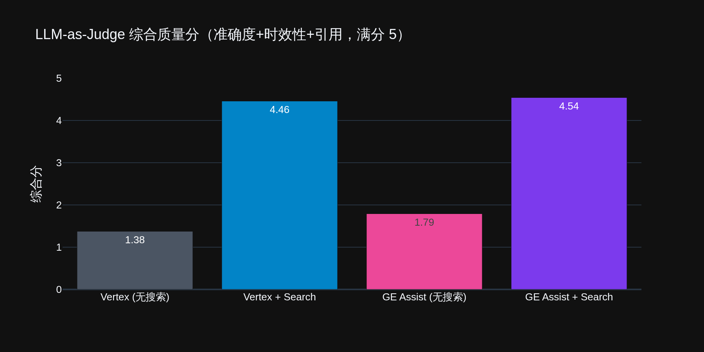
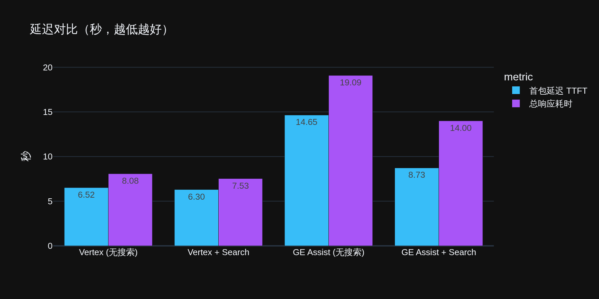
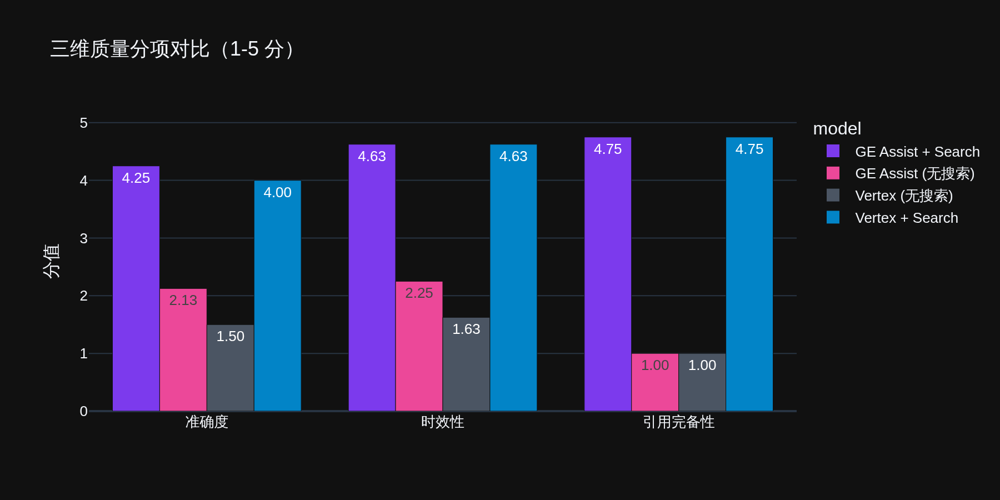
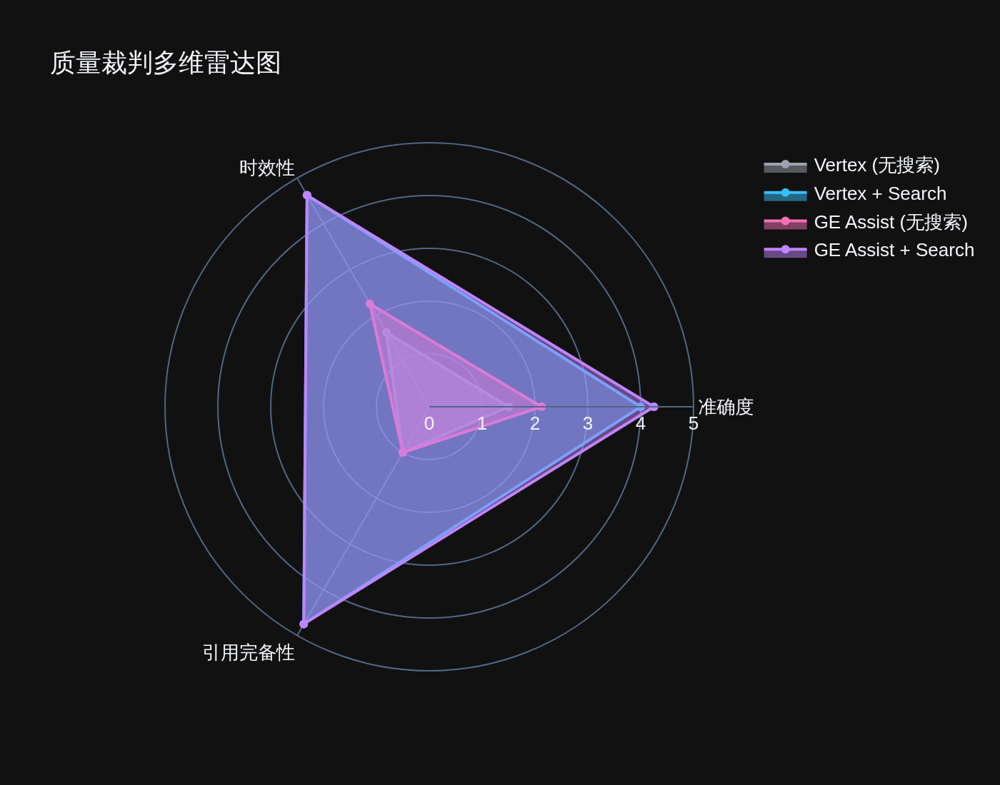
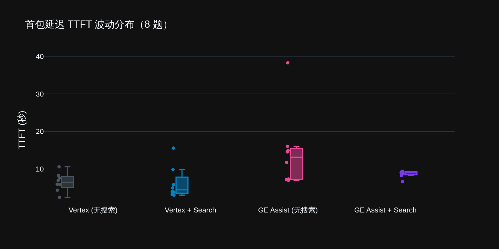
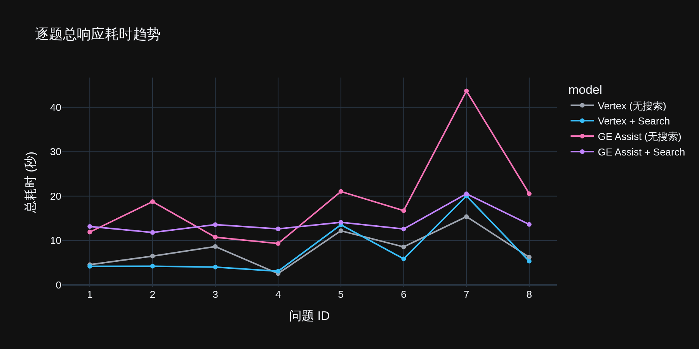

# Vertex AI Gemini vs. Gemini Enterprise App API — Comparison Report

> Benchmark date: 2026-05-23
> Tooling: this repository (`benchmark.py` + `dashboard.py`)
> Judge model: `gemini-2.5-flash` (2-stage LLM-as-a-Judge)

---

## 1. What We Compared

| Dimension | **Vertex AI (direct)** | **Gemini Enterprise (GE) App** |
|-----------|------------------------|--------------------------------|
| Product positioning | Developer API, pay-as-you-go | Enterprise employee assistant, per-seat subscription |
| Endpoint | `aiplatform.googleapis.com/v1/.../models/{model}:streamGenerateContent` | `discoveryengine.googleapis.com/v1alpha/.../engines/{app}/assistants/{assistant}:streamAssist` |
| Google Search wiring | `tools: [{google_search: {}}]` | `toolsSpec: {webGroundingSpec: {}}` (assistant must have `webGroundingType: GOOGLE_SEARCH`) |
| Model pinning | `gemini-2.5-flash` | `generationSpec.modelId` (e.g. `gemini-2.5-flash/answer_gen/v1`; empty = app default) |
| Auth | ADC / Service Account | ADC + `X-Goog-User-Project` header (seat must be allocated to the project) |

---

## 2. Measured Performance (8 questions × 4 channels)

### 2.1 Aggregate Means

| Channel | TTFT | E2E | Throughput | Citations | Accuracy | Recency | Citation | **Overall** |
|---------|------|-----|------------|-----------|----------|---------|----------|-------------|
| Vertex (no search) | 6.52s | 8.08s | 51 ch/s | 0 | 1.50 | 1.62 | 1.00 | 1.38 |
| **Vertex + Google Search** | **6.30s** | **7.53s** | **477 ch/s** | 9.8 | 4.00 | 4.62 | 4.75 | **4.46** |
| GE Assist (no search) | 14.65s | 19.09s | 36 ch/s | 0 | 2.12 | 2.25 | 1.00 | 1.79 |
| **GE Assist + Google Search** | 8.73s | 14.00s | 268 ch/s | **10.2** | **4.25** | 4.62 | 4.75 | **4.54** |





### 2.2 Head-to-Head: The Two Grounded Paths

| Dimension | Vertex + Search | GE + Search | Delta |
|-----------|-----------------|-------------|-------|
| Overall quality | 4.46 | **4.54** | GE +1.8% (within noise) |
| TTFT | **6.30s** | 8.73s | GE **+38%** slower |
| End-to-end | **7.53s** | 14.00s | GE **+86%** slower |
| Throughput | **477 ch/s** | 268 ch/s | GE **−44%** |
| Citations | 9.8 | 10.2 | tied |

**Takeaway:** Both paths hit the same Google Search index — answer quality is statistically indistinguishable. The GE Assistant orchestration layer (`plannerSteps` + persona injection) adds a fixed ~2.4s TTFT and ~6.5s E2E overhead.





### 2.3 Per-Question Breakdown (acc/rec/cite, TTFT in parentheses)

| Question | Vertex+Search | GE+Search | Note |
|----------|---------------|-----------|------|
| Q1 2025 UCL Final | 5/5/5 (3.3s) | 5/5/5 (9.0s) | tie |
| Q2 NVDA quarterly revenue | 2/5/5 (3.9s) | **5/5/5** (8.3s) | GE wins (Vertex accuracy 2) |
| Q3 Next total solar eclipse | **5/5/5** (3.9s) | 3/5/5 (9.4s) | Vertex wins |
| Q4 UK Prime Minister | 5/5/5 (3.1s) | 5/5/5 (9.4s) | tie |
| Q5 Live BTC price | 5/5/5 (9.9s) | 5/5/5 (8.7s) | tie |
| Q6 Latest Oscars Best Picture | 5/5/4 (5.8s) | 5/5/4 (9.1s) | tie |
| Q7 Recent OpenAI news | 1/2/4 (15.6s) | 1/2/4 (6.7s) | both miss |
| Q8 Artemis II launch date | 4/5/5 (5.0s) | **5/5/5** (9.1s) | GE edge |





---

## 3. Multimodal Output Capabilities

`AssistantContent.data` is a union type. GE `:streamAssist` orchestrates multimodal tools **within a single endpoint**:

| Output type | Vertex `generateContent` | GE `:streamAssist` | Verified |
|-------------|--------------------------|--------------------|---------| 
| `text` | ✅ | ✅ | — |
| `inlineData` (Blob) | ✅ | ✅ | — |
| `file` (mimeType + fileId) | ❌ | ✅ | returned `image/png` + fileId |
| `executableCode` | requires explicit `tools:[{code_execution:{}}]` | ✅ auto-triggered | `{language: PYTHON}` |
| `codeExecutionResult` | same | ✅ with auto-retry on failure | `OUTCOME_OK` |
| Image generation | requires switching to Imagen API / `-image` model | ✅ `toolsSpec:{imageGenerationSpec:{}}` | dispatches Nano Banana |
| `thought` reasoning | requires thinking model | ✅ | `thought: true` |
| `diagnosticInfo.plannerSteps` | ❌ | ✅ | agent reasoning trace |
| Multimodal input (file upload) | `fileData` URI | `AddContextFile` to session | — |

---

## 4. Pricing & Quotas

### 4.1 Vertex AI (Pay-as-you-go)

| Item | Price |
|------|-------|
| Gemini 2.5 Flash input | $0.30 / 1M tokens |
| Gemini 2.5 Flash output | $2.50 / 1M tokens |
| Grounding with Google Search (Gemini 2.x) | **$35 / 1,000 prompts** (first 1,500/day free; multiple searches in one prompt = one charge) |
| Grounding with Google Search (Gemini 3.x, from 2026-01-05) | **$14 / 1,000 search queries** (first 5,000/month free; charged per internal search) |
| Search-injected input tokens | **Not charged** |
| Rate limit | 30,000 RPM/model/region; Flash Tier 3 = 10M TPM (auto-tiered by 30-day spend) |

**Typical real-time Q&A** (measured ~30 in / ~2100 out tokens): $0.035 grounding + $0.005 tokens ≈ **$0.040/query**

### 4.2 Gemini Enterprise (Seat subscription + pooled quota)

| Edition | $/seat/mo | Assist queries/seat/day¹ | /seat/month | **In-quota $/query** |
|---------|-----------|---------------------------|-------------|----------------------|
| Frontline Starter | — | 20 | 600 | — |
| Frontline | $12.50 | 40 | 1,200 | $0.01042 |
| Business | $21 | 120 | 3,600 | **$0.00583** |
| Standard | $30 | 160 | 4,800 | **$0.00625** |
| Plus | $50 | 200 | 6,000 | $0.00833 |

¹ The Assistant query quota **already includes** Google Search / Web Grounding usage — no separate search fee.

**Quota mechanics:**
- **Pooled**: project total = per-seat quota × seat count, shared across all users
- **Abuse-prevention rate limit**: 10× the pooled quota (non-pooled)
- **API rate limit**: `:streamAssist` 600 QPM/project/region (observed)
- **Seat adjustment**: **cannot reduce** seat count mid-term

**Overage pricing:**
| Item | Overage |
|------|---------|
| Assistant query | **$0.10 / query** |
| Storage & indexing | $5 / GiB / month |
| Video generation | $0.40 / second |
| Deep Research | $4.00 / query |

---

## 5. Cost Model

### 5.1 Three-Zone Break-Even (1 Standard $30 seat vs. Vertex $0.040/query)

| Monthly queries Q | GE cost | Vertex cost | Winner |
|-------------------|---------|-------------|--------|
| Q < **750** | $30 (idle seat) | $0.040 × Q | **Vertex** (seat fee not amortized) |
| 750 ≤ Q ≤ 4,800 | $30 | $30 – $192 | **GE** (up to 6.4× cheaper) |
| 4,800 < Q ≤ 7,500 | $30 + (Q−4800)×$0.10 | $192 – $300 | **GE** (margin shrinking) |
| Q > **7,500** | overage-dominated | $0.040 × Q | **Vertex** (GE overage = 2.5× Vertex) |

### 5.2 Multi-Seat Scenario

With seats sized to peak demand, GE **marginal cost stays at $0.00583–$0.00625** — 6.4–6.9× cheaper than Vertex. Trade-offs: seats cannot be reduced mid-term, idle seats are sunk cost, and bursts above quota hit $0.10 overage.

---

## 6. Decision Matrix

| Scenario | Recommendation | Why |
|----------|---------------|-----|
| Internal employees, 30–160 queries/day/person | **GE Standard/Business** | Quota covers usage; $0.006/query, 6× cheaper |
| Programmatic API / external product / spiky traffic | **Vertex** | Fully elastic, no sunk seats, no overage penalty, no 600 QPM cap |
| Low frequency (< 25 queries/day/seat) | **Vertex** | GE seat fee doesn't amortize |
| Latency-sensitive (TTFT < 5s hard requirement) | **Vertex** | GE measured +38% TTFT, +86% E2E |
| Need image/video/code-exec/Deep Research in one call | **GE Plus** | Single-endpoint orchestration; Vertex requires separate Imagen/Veo/CodeExec calls and billing |
| Need agent reasoning trace, session memory, VPC-SC/CMEK | **GE** | Native support |
| Need real-time web info at minimal cost (< 1,500/day) | **Vertex** | Within free grounding tier ≈ $0.005/query (tokens only) |

---

## 7. Bottom Line

**Both paths hit the same Google Search — answer quality is a wash.** Vertex is the **fast, elastic, metered** developer API. Gemini Enterprise is the **slower (≈2×), seat-based, natively multimodal** employee assistant. Inside quota GE is 6× cheaper; outside quota GE is 2.5× more expensive. Choose based on whether you're **building a product** (Vertex) or **equipping a workforce** (GE).

---

## Appendix A — Reproduce This Benchmark

```bash
# 1. Configure .env (see .env.example)
GCP_PROJECT_ID=<your-project>
AGENT_SEARCH_ENGINE=<your-agentspace-app-id>   # discover via: python scripts/list_engines.py
AGENT_SEARCH_ASSISTANT=default_assistant
GEMINI_MODEL=gemini-2.5-flash

# 2. Start the proxy
python app.py

# 3. Run the full benchmark (8 questions × 4 channels + Judge)
python benchmark.py

# 4. View the dashboard
streamlit run dashboard.py

# 5. Regenerate the charts in this document
python scripts/render_charts.py
```

## Appendix B — References

- [Vertex AI Generative AI Pricing](https://cloud.google.com/vertex-ai/generative-ai/pricing)
- [Grounding with Google Search](https://cloud.google.com/vertex-ai/generative-ai/docs/grounding/grounding-with-google-search)
- [Gemini Enterprise StreamAssist Guide](https://docs.cloud.google.com/gemini/enterprise/docs/get-answers-from-streamassist)
- [AssistAnswer REST Reference](https://docs.cloud.google.com/generative-ai-app-builder/docs/reference/rest/v1/projects.locations.collections.engines.sessions.assistAnswers)
- [Gemini Enterprise Licenses & Pooled Quotas](https://docs.cloud.google.com/gemini/enterprise/docs/licenses)
- Gemini Enterprise internal quota deck (per-seat daily quotas & overage pricing)
